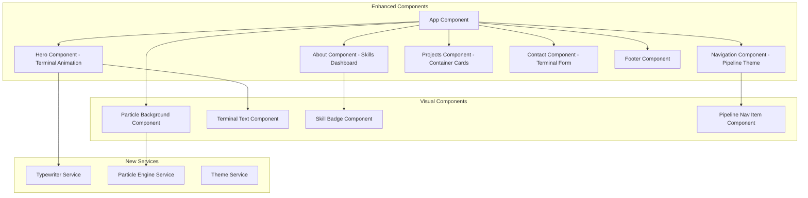

# Design Document: DevOps UI/UX Enhancement

## Overview

This design document outlines the architecture and implementation approach for transforming the existing Angular portfolio into a unique DevOps-themed experience. The enhancement focuses on terminal aesthetics, infrastructure visualizations, and interactive elements that reflect the owner's identity as an aspiring DevOps engineer. The implementation leverages Angular's animation system, custom SCSS theming, and canvas-based particle effects.

## Architecture

### High-Level Architecture



### New Directory Structure

```
src/app/
├── components/
│   ├── shared/
│   │   ├── particle-background/
│   │   │   ├── particle-background.component.ts
│   │   │   ├── particle-background.component.html
│   │   │   └── particle-background.component.scss
│   │   ├── terminal-text/
│   │   │   ├── terminal-text.component.ts
│   │   │   ├── terminal-text.component.html
│   │   │   └── terminal-text.component.scss
│   │   └── skill-badge/
│   │       ├── skill-badge.component.ts
│   │       ├── skill-badge.component.html
│   │       └── skill-badge.component.scss
│   ├── navigation/ (enhanced)
│   ├── hero/ (enhanced)
│   ├── about/ (enhanced)
│   ├── projects/ (enhanced)
│   └── contact/ (enhanced)
├── services/
│   ├── typewriter.service.ts
│   ├── particle.service.ts
│   └── theme.service.ts
└── shared/
    └── styles/
        ├── _variables.scss (updated - dark theme)
        ├── _terminal.scss (new)
        ├── _animations.scss (enhanced)
        └── _glow-effects.scss (new)
```

## Components and Interfaces

### Particle Background Component

Creates an animated network topology background using HTML5 Canvas.

```typescript
interface Particle {
  x: number;
  y: number;
  vx: number;
  vy: number;
  radius: number;
  color: string;
  connections: number[];
}

interface ParticleConfig {
  particleCount: number;
  connectionDistance: number;
  particleSpeed: number;
  mouseInteraction: boolean;
  colors: string[];
}

// Component responsibilities:
// - Initialize canvas with particle system
// - Animate particles with requestAnimationFrame
// - Draw connection lines between nearby particles
// - Respond to mouse movement for interactivity
// - Handle window resize events
```

### Terminal Text Component

Reusable component for terminal-style text with typing animation.

```typescript
interface TerminalTextConfig {
  prefix?: string;           // e.g., "$ ", "> ", "~/portfolio $ "
  text: string;
  typingSpeed?: number;      // ms per character
  showCursor?: boolean;
  cursorChar?: string;       // default: "▋"
  onComplete?: () => void;
}

// Component responsibilities:
// - Display text with typing animation
// - Show blinking cursor
// - Support command-prompt prefixes
// - Emit completion events
```

### Skill Badge Component

Interactive badge for displaying skills with DevOps categorization.

```typescript
interface SkillBadgeConfig {
  skill: EnhancedSkill;
  showProficiency: boolean;
  animateOnHover: boolean;
}

interface EnhancedSkill {
  name: string;
  category: 'cicd' | 'containers' | 'cloud' | 'monitoring' | 'iac' | 'languages';
  icon: string;
  proficiency: number;  // 0-100
  description?: string;
}

// Component responsibilities:
// - Display skill with icon and name
// - Show proficiency bar on hover
// - Animate expansion for details
// - Apply category-specific styling
```

### Enhanced Navigation Component

Pipeline-themed navigation with stage indicators.

```typescript
interface PipelineStage {
  id: string;
  label: string;
  icon: string;
  status: 'pending' | 'active' | 'completed';
}

// Component responsibilities:
// - Display navigation as pipeline stages
// - Animate connections between stages
// - Show pulsing indicator for active section
// - Transform to terminal menu on mobile
```

### Enhanced Hero Component

Terminal-style hero with typing animations and particle background.

```typescript
interface HeroCommand {
  command: string;
  output: string;
  delay: number;
}

// Component responsibilities:
// - Display sequential terminal commands
// - Animate typing for each command
// - Show particle background integration
// - Reveal CTAs after animation sequence
```

### Enhanced Project Card Component

Container/deployment styled project cards.

```typescript
interface DeploymentCard {
  project: Project;
  status: 'running' | 'deployed' | 'building';
  containerTags: string[];
}

// Component responsibilities:
// - Display project as container card
// - Show status indicator (green dot)
// - Animate deployment log on hover
// - Display tech stack as container tags
```

## Data Models

### Enhanced Skill Model

```typescript
// src/app/models/skill.model.ts
export interface EnhancedSkill {
  name: string;
  category: SkillCategory;
  icon: string;
  proficiency: number;
  description?: string;
  yearsExperience?: number;
}

export type SkillCategory = 
  | 'cicd' 
  | 'containers' 
  | 'cloud' 
  | 'monitoring' 
  | 'iac' 
  | 'languages';

export const CATEGORY_LABELS: Record<SkillCategory, string> = {
  cicd: 'CI/CD',
  containers: 'Containers & Orchestration',
  cloud: 'Cloud Platforms',
  monitoring: 'Monitoring & Logging',
  iac: 'Infrastructure as Code',
  languages: 'Languages & Scripting'
};
```

### Theme Configuration

```typescript
// src/app/models/theme.model.ts
export interface TerminalTheme {
  background: string;
  backgroundGradient: string;
  textPrimary: string;
  textSecondary: string;
  accentGreen: string;
  accentCyan: string;
  accentPurple: string;
  glowColor: string;
  borderColor: string;
}

export const DEVOPS_THEME: TerminalTheme = {
  background: '#0a0a0a',
  backgroundGradient: 'linear-gradient(135deg, #0a0a0a 0%, #1a1a2e 100%)',
  textPrimary: '#ffffff',
  textSecondary: '#a0a0a0',
  accentGreen: '#00ff00',
  accentCyan: '#00ffff',
  accentPurple: '#bd93f9',
  glowColor: 'rgba(0, 255, 0, 0.5)',
  borderColor: '#333333'
};
```

## Services

### Typewriter Service

```typescript
// src/app/services/typewriter.service.ts
// Responsibilities:
// - Provide typing animation logic
// - Support variable typing speeds
// - Handle multiple text sequences
// - Emit character-by-character updates
```

### Particle Service

```typescript
// src/app/services/particle.service.ts
// Responsibilities:
// - Manage particle system state
// - Calculate particle positions and velocities
// - Determine particle connections
// - Handle mouse interaction calculations
```

## Styling Architecture

### Updated Variables

```scss
// src/app/shared/styles/_variables.scss (additions)

// DevOps Dark Theme Colors
$color-bg-dark: #0a0a0a;
$color-bg-dark-secondary: #1a1a2e;
$color-bg-terminal: #0d1117;
$color-bg-card: rgba(26, 26, 46, 0.8);

$color-terminal-green: #00ff00;
$color-terminal-cyan: #00ffff;
$color-terminal-purple: #bd93f9;
$color-terminal-yellow: #f1fa8c;
$color-terminal-red: #ff5555;
$color-terminal-orange: #ffb86c;

$color-glow-green: rgba(0, 255, 0, 0.5);
$color-glow-cyan: rgba(0, 255, 255, 0.5);

// Terminal Typography
$font-family-terminal: 'JetBrains Mono', 'Fira Code', 'Consolas', monospace;

// Glow Effects
$glow-sm: 0 0 5px;
$glow-md: 0 0 10px;
$glow-lg: 0 0 20px;
$glow-xl: 0 0 30px;
```

### Terminal Styles

```scss
// src/app/shared/styles/_terminal.scss

@mixin terminal-text {
  font-family: $font-family-terminal;
  color: $color-terminal-green;
  text-shadow: $glow-sm $color-glow-green;
}

@mixin terminal-box {
  background: $color-bg-terminal;
  border: 1px solid $color-border-terminal;
  border-radius: $radius-md;
  box-shadow: $glow-md $color-glow-green;
}

@mixin cursor-blink {
  animation: blink 1s step-end infinite;
}

@keyframes blink {
  50% { opacity: 0; }
}
```

### Glow Effects

```scss
// src/app/shared/styles/_glow-effects.scss

@mixin glow-on-hover($color: $color-terminal-green) {
  transition: box-shadow $transition-normal, text-shadow $transition-normal;
  
  &:hover {
    box-shadow: $glow-lg rgba($color, 0.5);
    text-shadow: $glow-md rgba($color, 0.8);
  }
}

@mixin pulse-glow($color: $color-terminal-green) {
  animation: pulse-glow 2s ease-in-out infinite;
  
  @keyframes pulse-glow {
    0%, 100% { box-shadow: $glow-sm rgba($color, 0.5); }
    50% { box-shadow: $glow-lg rgba($color, 0.8); }
  }
}
```


## Correctness Properties

*A property is a characteristic or behavior that should hold true across all valid executions of a system—essentially, a formal statement about what the system should do. Properties serve as the bridge between human-readable specifications and machine-verifiable correctness guarantees.*

### Property 1: Terminal Text Output Completeness

*For any* valid text input and command prefix, the Terminal Text component SHALL output the complete text with the prefix after the typing animation completes.

**Validates: Requirements 1.1, 1.3**

### Property 2: CTA Visibility After Animation

*For any* hero component instance, the call-to-action buttons SHALL become visible (visibility state = true) after the typewriter service emits a completion event.

**Validates: Requirements 1.4**

### Property 3: Navigation Section Completeness

*For any* navigation configuration, the Navigation component SHALL render exactly one link for each required section (Home, About, Projects, Contact).

**Validates: Requirements 2.1**

### Property 4: Active Section Tracking Consistency

*For any* scroll position within a section's viewport bounds, the scroll service SHALL emit that section's ID as the active section, and the navigation SHALL highlight only that section.

**Validates: Requirements 2.3**

### Property 5: Skill Rendering Completeness

*For any* array of EnhancedSkill objects, the About component SHALL render all skills, each skill SHALL appear in its correct category group, and each skill with a proficiency value SHALL display that proficiency.

**Validates: Requirements 3.1, 3.3, 3.4**

### Property 6: Project Card Content Completeness

*For any* valid Project object, the rendered project card SHALL contain the project's title, description, status indicator, and all technologies rendered as tags.

**Validates: Requirements 4.1, 4.3**

### Property 7: Project Card Expansion State

*For any* project card, clicking the card SHALL toggle its expanded state, and the expanded state SHALL reveal the terminal-style detail view.

**Validates: Requirements 4.5**

### Property 8: Contact Information Rendering

*For any* valid Profile object with email and socialLinks, the Contact component SHALL render the email as a terminal command and all social links as network endpoints.

**Validates: Requirements 5.1, 5.4**

### Property 9: Form Submission Success State

*For any* valid contact form submission (non-empty name, valid email, non-empty message), the form SHALL display a success state with "connection established" messaging.

**Validates: Requirements 5.3**

### Property 10: Form Error Display Format

*For any* invalid contact form submission, the error messages SHALL be displayed in terminal error format (containing error styling class and descriptive message).

**Validates: Requirements 5.5**

### Property 11: Particle Mouse Interaction

*For any* mouse position within the canvas bounds, the particle service SHALL calculate attraction/repulsion effects on nearby particles, resulting in position changes proportional to distance from mouse.

**Validates: Requirements 6.1**

### Property 12: Theme Configuration Validity

*For any* theme configuration object, it SHALL contain a dark background color (luminance < 0.1), terminal-green accent (#00ff00 or similar), and monospace font family definition.

**Validates: Requirements 6.3, 7.1, 7.2**

### Property 13: Text Contrast Accessibility

*For any* text element rendered on the dark background, the contrast ratio between text color and background color SHALL be at least 4.5:1 (WCAG AA standard).

**Validates: Requirements 7.3**

### Property 14: Section Header Terminal Prefix

*For any* section header rendered in the portfolio, the header text SHALL be prefixed with a terminal prompt character (e.g., "$", ">", "~") or contain ASCII decorative elements.

**Validates: Requirements 7.5**

### Property 15: Loading State Indicator

*For any* component in a loading state, the component SHALL display a terminal-style loading indicator (containing animation class and loading text pattern).

**Validates: Requirements 8.3**

## Error Handling

### Animation Errors

| Error Condition | Behavior | Recovery |
|----------------|----------|----------|
| Typewriter animation fails | Display text immediately without animation | Graceful degradation |
| Particle canvas not supported | Hide particle background | Show static gradient |
| Animation frame drops | Reduce particle count | Maintain performance |

### Form Validation Errors

| Error Condition | Terminal-Style Message | Visual Treatment |
|----------------|----------------------|------------------|
| Empty name field | `ERROR: name field required` | Red glow, error icon |
| Empty email field | `ERROR: email field required` | Red glow, error icon |
| Invalid email format | `ERROR: invalid email format` | Red glow, error icon |
| Empty message field | `ERROR: message field required` | Red glow, error icon |
| Submission failed | `CONNECTION FAILED: retry?` | Red pulse animation |

### Data Loading Errors

| Error Condition | Behavior |
|----------------|----------|
| Profile data missing | Display placeholder with terminal "loading..." |
| Project data missing | Show "No deployments found" message |
| Image load failure | Display terminal-style placeholder icon |
| Icon load failure | Show text-only fallback |

## Testing Strategy

### Unit Tests

Unit tests will verify specific component behaviors and edge cases:

- Terminal text component renders complete text after animation
- Particle service creates correct number of particles
- Skill badge displays all required information
- Navigation renders all section links
- Project card displays status indicator and tags
- Contact form validation catches all error conditions
- Theme service provides correct color values
- Typewriter service emits completion events

### Property-Based Tests

Property-based tests will use fast-check with Jasmine to verify universal properties:

- **Minimum 100 iterations per property test**
- Each test tagged with: **Feature: devops-ui-enhancement, Property {number}: {property_text}**

Properties to test:
1. Terminal text always outputs complete text with prefix
2. CTA visibility changes after animation completion
3. Navigation always includes all required sections
4. Active section tracking is consistent for scroll positions
5. All skills are rendered with correct categorization
6. All project cards contain required elements
7. Project card expansion state toggles correctly
8. Contact info renders all provided data
9. Valid form submissions show success state
10. Invalid submissions show terminal-style errors
11. Particle positions respond to mouse coordinates
12. Theme configuration contains required values
13. Text contrast meets accessibility standards
14. Section headers contain terminal prefixes
15. Loading states display terminal indicators

### Integration Tests

- Hero animation sequence completes correctly
- Navigation scroll behavior with active tracking
- Project card click and expansion flow
- Contact form submission and response handling
- Particle background mouse interaction
- Mobile menu toggle and animation

### Visual Regression Tests

- Dark theme consistency across components
- Glow effects on interactive elements
- Terminal text styling consistency
- Responsive layout at all breakpoints

### Accessibility Testing

- Keyboard navigation through all interactive elements
- Screen reader compatibility with animations
- Color contrast verification (WCAG AA)
- Focus management during animations
- Reduced motion preference support

## Animation Specifications

### Typing Animation

```typescript
const TYPING_CONFIG = {
  baseSpeed: 50,        // ms per character
  variability: 20,      // random variance
  pauseOnPunctuation: 200,
  cursorBlinkRate: 530  // ms
};
```

### Particle Animation

```typescript
const PARTICLE_CONFIG = {
  count: 80,
  maxSpeed: 0.5,
  connectionDistance: 150,
  mouseRadius: 100,
  mouseForce: 0.02
};
```

### Transition Timings

```typescript
const TRANSITIONS = {
  fast: '150ms ease',
  normal: '300ms ease',
  slow: '500ms ease',
  glow: '200ms ease-in-out'
};
```
