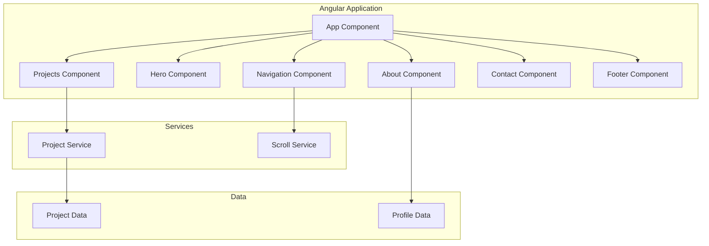

# Design Document: Portfolio Website

## Overview

This design document outlines the architecture and implementation approach for a personal portfolio website built with Angular. The portfolio will be a single-page application (SPA) with smooth scrolling between sections, responsive design, and modern aesthetics. The application leverages Angular's component-based architecture to create reusable, maintainable UI elements.

### Enhanced UI/UX Features

The portfolio will feature:
- **Modern Visual Design**: Gradient backgrounds, glassmorphism effects, and refined color palette
- **Rich Animations**: Scroll-triggered animations, parallax effects, and smooth micro-interactions
- **Interactive Elements**: Hover effects, animated buttons, interactive project cards with reveal effects
- **Enhanced Typography**: Better hierarchy, improved readability, and modern font pairing
- **Improved Spacing**: Better visual breathing room and section separation
- **Smooth Transitions**: Polished animations for all interactive elements
- **Visual Feedback**: Clear hover states, loading states, and interactive feedback

## Architecture

### High-Level Architecture



### Application Structure

```
src/app/
├── components/
│   ├── navigation/
│   │   ├── navigation.component.ts
│   │   ├── navigation.component.html
│   │   └── navigation.component.scss
│   ├── hero/
│   │   ├── hero.component.ts
│   │   ├── hero.component.html
│   │   └── hero.component.scss
│   ├── about/
│   │   ├── about.component.ts
│   │   ├── about.component.html
│   │   └── about.component.scss
│   ├── projects/
│   │   ├── projects.component.ts
│   │   ├── projects.component.html
│   │   ├── projects.component.scss
│   │   └── project-card/
│   │       ├── project-card.component.ts
│   │       ├── project-card.component.html
│   │       └── project-card.component.scss
│   ├── contact/
│   │   ├── contact.component.ts
│   │   ├── contact.component.html
│   │   └── contact.component.scss
│   └── footer/
│       ├── footer.component.ts
│       ├── footer.component.html
│       └── footer.component.scss
├── services/
│   ├── project.service.ts
│   └── scroll.service.ts
├── models/
│   ├── project.model.ts
│   └── profile.model.ts
├── data/
│   ├── projects.data.ts
│   └── profile.data.ts
└── shared/
    └── styles/
        ├── _variables.scss
        ├── _mixins.scss
        └── _animations.scss
```

## Components and Interfaces

### Navigation Component

Handles site navigation with responsive behavior.

```typescript
interface NavigationItem {
  label: string;
  sectionId: string;
  icon?: string;
}

// Component responsibilities:
// - Display navigation links
// - Track active section on scroll
// - Toggle mobile menu
// - Smooth scroll to sections
```

### Hero Component

Displays the main introduction section.

```typescript
interface HeroContent {
  name: string;
  title: string;
  tagline: string;
  ctaText: string;
  ctaLink: string;
}

// Component responsibilities:
// - Display owner name and title
// - Show call-to-action button
// - Optional background animation or image
```

### About Component

Shows professional background and skills.

```typescript
interface Skill {
  name: string;
  category: 'frontend' | 'backend' | 'tools' | 'other';
  proficiency?: number; // 1-100
}

interface ProfileInfo {
  bio: string;
  photoUrl?: string;
  skills: Skill[];
  experience?: string[];
}

// Component responsibilities:
// - Display bio text
// - Render skills in categorized groups
// - Show profile photo if available
```

### Projects Component

Displays the portfolio of work.

```typescript
interface Project {
  id: string;
  title: string;
  description: string;
  shortDescription: string;
  thumbnailUrl: string;
  technologies: string[];
  liveUrl?: string;
  sourceUrl?: string;
  featured: boolean;
}

// Component responsibilities:
// - Display project grid
// - Filter/sort projects (optional)
// - Handle project card interactions
```

### Project Card Component

Individual project display card.

```typescript
// Component responsibilities:
// - Display project thumbnail
// - Show title and short description
// - Reveal action buttons on hover
// - Emit selection events
```

### Contact Component

Provides contact options and optional form.

```typescript
interface ContactInfo {
  email: string;
  socialLinks: SocialLink[];
}

interface SocialLink {
  platform: string;
  url: string;
  icon: string;
}

interface ContactFormData {
  name: string;
  email: string;
  message: string;
}

// Component responsibilities:
// - Display contact information
// - Render social media links
// - Handle form validation and submission
```

## Data Models

### Project Model

```typescript
// src/app/models/project.model.ts
export interface Project {
  id: string;
  title: string;
  description: string;
  shortDescription: string;
  thumbnailUrl: string;
  images?: string[];
  technologies: string[];
  liveUrl?: string;
  sourceUrl?: string;
  featured: boolean;
  category?: string;
  completedDate?: Date;
}
```

### Profile Model

```typescript
// src/app/models/profile.model.ts
export interface Profile {
  name: string;
  title: string;
  tagline: string;
  bio: string;
  photoUrl?: string;
  email: string;
  skills: Skill[];
  socialLinks: SocialLink[];
}

export interface Skill {
  name: string;
  category: 'frontend' | 'backend' | 'tools' | 'other';
  icon?: string;
}

export interface SocialLink {
  platform: string;
  url: string;
  icon: string;
}
```

## Services

### Scroll Service

```typescript
// src/app/services/scroll.service.ts
// Responsibilities:
// - Smooth scroll to section by ID
// - Track current visible section
// - Emit active section changes for navigation highlighting
```

### Project Service

```typescript
// src/app/services/project.service.ts
// Responsibilities:
// - Provide project data
// - Filter projects by category
// - Get featured projects
// - Get project by ID
```


## Correctness Properties

*A property is a characteristic or behavior that should hold true across all valid executions of a system—essentially, a formal statement about what the system should do. Properties serve as the bridge between human-readable specifications and machine-verifiable correctness guarantees.*

### Property 1: Hero Content Rendering

*For any* valid Profile object with name and title fields, the Hero component SHALL render both the name and title/tagline in the output.

**Validates: Requirements 1.1, 1.2**

### Property 2: Navigation Links Completeness

*For any* navigation configuration, the Navigation component SHALL render links for all required sections (Home, About, Projects, Contact).

**Validates: Requirements 2.1**

### Property 3: Active Section Tracking

*For any* scroll position within a section's bounds, the Scroll Service SHALL correctly identify and emit that section as the active section.

**Validates: Requirements 2.4**

### Property 4: Profile Data Rendering

*For any* valid Profile object, the About component SHALL render the bio text and all skills from the skills array.

**Validates: Requirements 3.1, 3.2**

### Property 5: Conditional Photo Display

*For any* Profile object, the About component SHALL render a profile photo if and only if photoUrl is defined and non-empty.

**Validates: Requirements 3.3**

### Property 6: Project Card Content

*For any* valid Project object, the rendered project card SHALL contain the project's title, shortDescription, and thumbnailUrl.

**Validates: Requirements 4.1**

### Property 7: Project Links Conditional Rendering

*For any* Project object with liveUrl or sourceUrl defined, the project details SHALL include clickable links to those URLs. Projects without these URLs SHALL not render broken or empty links.

**Validates: Requirements 4.3**

### Property 8: Contact Information Display

*For any* valid Profile object with email and socialLinks, the Contact component SHALL render the email and all social link entries.

**Validates: Requirements 5.1**

### Property 9: Form Validation - Invalid Inputs

*For any* contact form submission where required fields are empty or email format is invalid, the form validation SHALL return errors and prevent submission.

**Validates: Requirements 5.3**

### Property 10: Image Accessibility

*For any* image element rendered in the portfolio, the element SHALL have a non-empty alt attribute.

**Validates: Requirements 7.3**

## Error Handling

### Form Validation Errors

| Error Condition | User Feedback | Recovery Action |
|----------------|---------------|-----------------|
| Empty name field | "Name is required" | Highlight field, focus |
| Empty email field | "Email is required" | Highlight field, focus |
| Invalid email format | "Please enter a valid email" | Highlight field |
| Empty message field | "Message is required" | Highlight field, focus |

### Data Loading Errors

| Error Condition | Behavior |
|----------------|----------|
| Missing profile data | Display placeholder content with defaults |
| Missing project data | Show "No projects available" message |
| Image load failure | Display fallback placeholder image |

## Visual Design System

### Color Palette Enhancement

The portfolio uses a modern, sophisticated color scheme with gradient support:

```scss
// Primary Gradient
$gradient-primary: linear-gradient(135deg, #667eea 0%, #764ba2 100%);
$gradient-secondary: linear-gradient(135deg, #f093fb 0%, #f5576c 100%);
$gradient-accent: linear-gradient(135deg, #4facfe 0%, #00f2fe 100%);

// Glassmorphism
$glass-bg: rgba(255, 255, 255, 0.1);
$glass-border: rgba(255, 255, 255, 0.2);
$glass-backdrop: blur(10px);
```

### Typography Hierarchy

- **Headings**: Bold, large sizes with gradient text effects
- **Body Text**: Clear, readable with proper line-height
- **Accents**: Smaller text with color emphasis for CTAs and highlights

### Animation Principles

1. **Entrance Animations**: Fade-in-up, scale-in effects on section visibility
2. **Hover Effects**: Smooth scale, color transitions, shadow elevation
3. **Scroll Effects**: Parallax, stagger animations for list items
4. **Micro-interactions**: Button press feedback, loading states

## Testing Strategy

### Unit Tests

Unit tests will verify specific component behaviors and edge cases:

- Navigation component renders correct number of links
- Hero component displays provided content
- About component handles missing optional fields gracefully
- Project card displays all required information
- Contact form validation catches all error conditions
- Services return expected data transformations

### Property-Based Tests

Property-based tests will use a testing library (e.g., fast-check with Jasmine/Jest) to verify universal properties:

- **Minimum 100 iterations per property test**
- Each test tagged with: **Feature: portfolio-website, Property {number}: {property_text}**

Properties to test:
1. Hero content always renders name and title from any valid profile
2. Navigation always includes all required section links
3. Active section detection is consistent for any scroll position
4. All profile skills are rendered in about section
5. Photo renders if and only if URL is provided
6. All project cards contain required fields
7. Project links render only when URLs are defined
8. Contact info renders all provided social links
9. Form validation rejects all invalid input combinations
10. All images have alt text

### Integration Tests

- Navigation scroll behavior
- Project card click interactions
- Contact form submission flow
- Responsive layout breakpoints

### Accessibility Testing

- Keyboard navigation through all interactive elements
- Screen reader compatibility
- Color contrast verification
- Focus management
